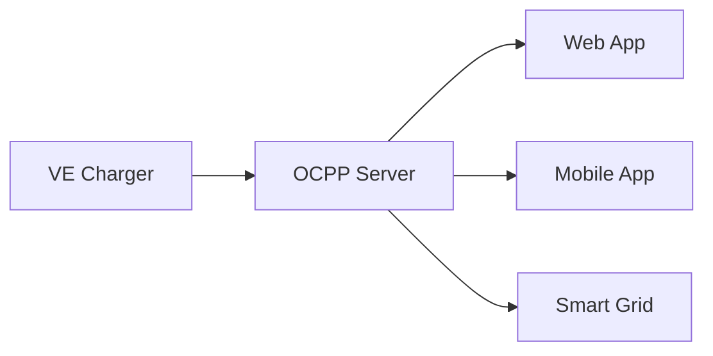

# Open Charge Point Protocol

Open Charge Point Protocol `OCPP` é um protocolo de comunicação aberto usado para a interação entre estações de carregamento de veículos elétricos (EVSE - Electric Vehicle Supply Equipment) e sistemas de gerenciamento central (CSMS - Charging Station Management System). Ele é projetado para permitir interoperabilidade entre diferentes fabricantes de carregadores e sistemas de backend.

