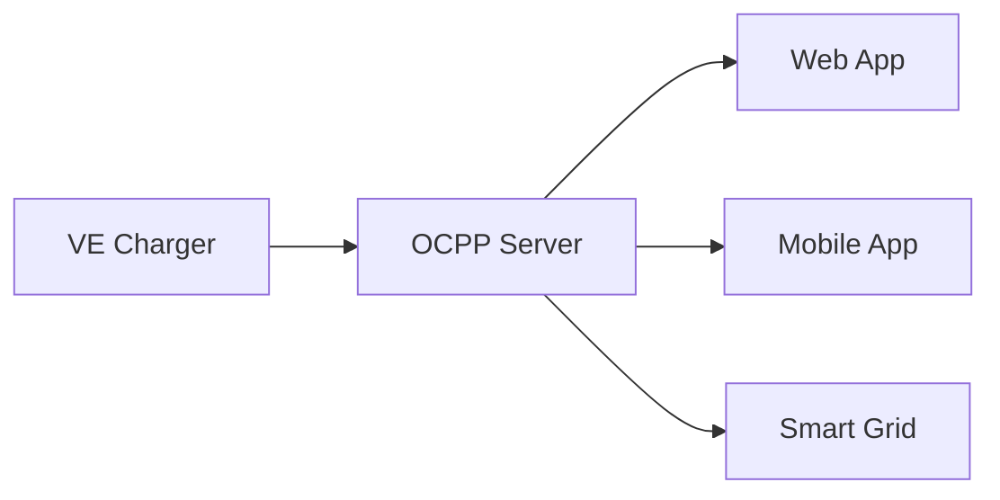

# Open Charge Point Protocol

O `OCPP` (Open Charge Point Protocol) é um protocolo de comunicação padronizado que permite a interoperabilidade entre estações de carregamento de veículos elétricos (`EVSE` - Electric Vehicle Supply Equipment) e sistemas de gerenciamento centralizados (`CSMS` - Charging Station Management System). Ele é mantido pela Open Charge Alliance (OCA) e atualmente está disponível nas versões `OCPP 1.6` e `OCPP 2.0.1`, sendo esta última a mais recente e robusta.

> Arquitetura `OCPP`

O `OCPP` segue um modelo cliente-servidor e é baseado em comunicação assíncrona via `WebSockets`, permitindo interações bidirecionais em tempo real entre a estação de carregamento `(Charge Point)` e outras aplicações.

> JSON-RPC (Remote Procedure Call) 2.0

JSON-RPC é um protocolo de chamada de procedimento remoto (RPC) leve e sem estado. Basicamente, essa especificação define várias estruturas de dados e as regras em torno de seu processamento. É agnóstico em relação ao transporte, pois os conceitos podem ser usados ​​em `sockets`, `http` ou em muitos ambientes de passagem de mensagens. Ele usa JSON (RFC 4627) como formato de dados.

