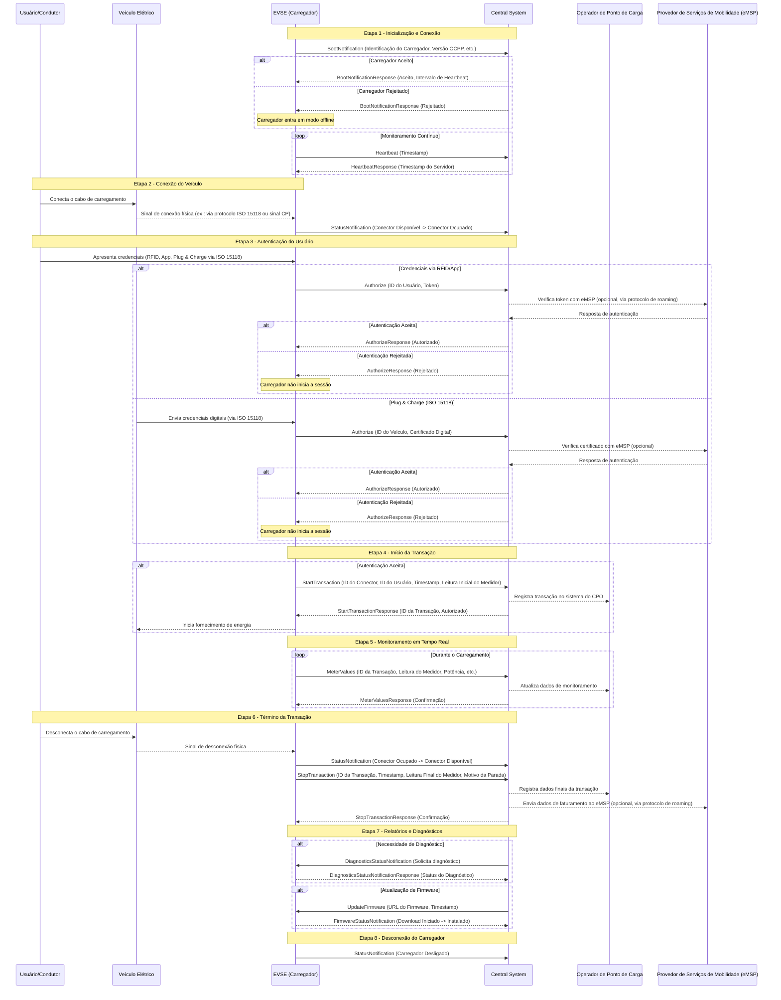

## OCPP Fluxo de eventos

```mermaid
sequenceDiagram
    participant U as Usuário/Condutor
    participant V as Veículo Elétrico
    participant E as EVSE (Carregador)
    participant CS as Central System
    participant CPO as Operador de Ponto de Carga
    participant MSP as Provedor de Serviços de Mobilidade (eMSP)

    %% Inicialização do Carregador
    Note over E,CS: Etapa 1 - Inicialização e Conexão
    E->>CS: BootNotification (Identificação do Carregador, Versão OCPP, etc.)
    alt Carregador Aceito
        CS-->>E: BootNotificationResponse (Aceito, Intervalo de Heartbeat)
    else Carregador Rejeitado
        CS-->>E: BootNotificationResponse (Rejeitado)
        Note over E: Carregador entra em modo offline
    end

    %% Heartbeat para Monitoramento
    loop Monitoramento Contínuo
        E->>CS: Heartbeat (Timestamp)
        CS-->>E: HeartbeatResponse (Timestamp do Servidor)
    end

    %% Conexão do Veículo e Autenticação do Usuário
    Note over U,E: Etapa 2 - Conexão do Veículo
    U->>V: Conecta o cabo de carregamento
    V-->>E: Sinal de conexão física (ex.: via protocolo ISO 15118 ou sinal CP)
    E->>CS: StatusNotification (Conector Disponível -> Conector Ocupado)

    Note over U,CS: Etapa 3 - Autenticação do Usuário
    U->>E: Apresenta credenciais (RFID, App, Plug & Charge via ISO 15118)
    alt Credenciais via RFID/App
        E->>CS: Authorize (ID do Usuário, Token)
        CS-->>MSP: Verifica token com eMSP (opcional, via protocolo de roaming)
        MSP-->>CS: Resposta de autenticação
        alt Autenticação Aceita
            CS-->>E: AuthorizeResponse (Autorizado)
        else Autenticação Rejeitada
            CS-->>E: AuthorizeResponse (Rejeitado)
            Note over E: Carregador não inicia a sessão
        end
    else Plug & Charge (ISO 15118)
        V->>E: Envia credenciais digitais (via ISO 15118)
        E->>CS: Authorize (ID do Veículo, Certificado Digital)
        CS-->>MSP: Verifica certificado com eMSP (opcional)
        MSP-->>CS: Resposta de autenticação
        alt Autenticação Aceita
            CS-->>E: AuthorizeResponse (Autorizado)
        else Autenticação Rejeitada
            CS-->>E: AuthorizeResponse (Rejeitado)
            Note over E: Carregador não inicia a sessão
        end
    end

    %% Início da Transação de Carregamento
    Note over E,CS: Etapa 4 - Início da Transação
    alt Autenticação Aceita
        E->>CS: StartTransaction (ID do Conector, ID do Usuário, Timestamp, Leitura Inicial do Medidor)
        CS-->>CPO: Registra transação no sistema do CPO
        CS-->>E: StartTransactionResponse (ID da Transação, Autorizado)
        E-->>V: Inicia fornecimento de energia
    end

    %% Monitoramento Durante o Carregamento
    Note over E,CS: Etapa 5 - Monitoramento em Tempo Real
    loop Durante o Carregamento
        E->>CS: MeterValues (ID da Transação, Leitura do Medidor, Potência, etc.)
        CS-->>CPO: Atualiza dados de monitoramento
        CS-->>E: MeterValuesResponse (Confirmação)
    end

    %% Término da Transação de Carregamento
    Note over U,CS: Etapa 6 - Término da Transação
    U->>V: Desconecta o cabo de carregamento
    V-->>E: Sinal de desconexão física
    E->>CS: StatusNotification (Conector Ocupado -> Conector Disponível)
    E->>CS: StopTransaction (ID da Transação, Timestamp, Leitura Final do Medidor, Motivo da Parada)
    CS-->>CPO: Registra dados finais da transação
    CS-->>MSP: Envia dados de faturamento ao eMSP (opcional, via protocolo de roaming)
    CS-->>E: StopTransactionResponse (Confirmação)

    %% Relatórios e Diagnósticos (Opcional)
    Note over E,CS: Etapa 7 - Relatórios e Diagnósticos
    alt Necessidade de Diagnóstico
        CS->>E: DiagnosticsStatusNotification (Solicita diagnóstico)
        E-->>CS: DiagnosticsStatusNotificationResponse (Status do Diagnóstico)
    end
    alt Atualização de Firmware
        CS->>E: UpdateFirmware (URL do Firmware, Timestamp)
        E-->>CS: FirmwareStatusNotification (Download Iniciado -> Instalado)
    end

    %% Desconexão do Carregador (Opcional)
    Note over E,CS: Etapa 8 - Desconexão do Carregador
    E->>CS: StatusNotification (Carregador Desligado)
``` 